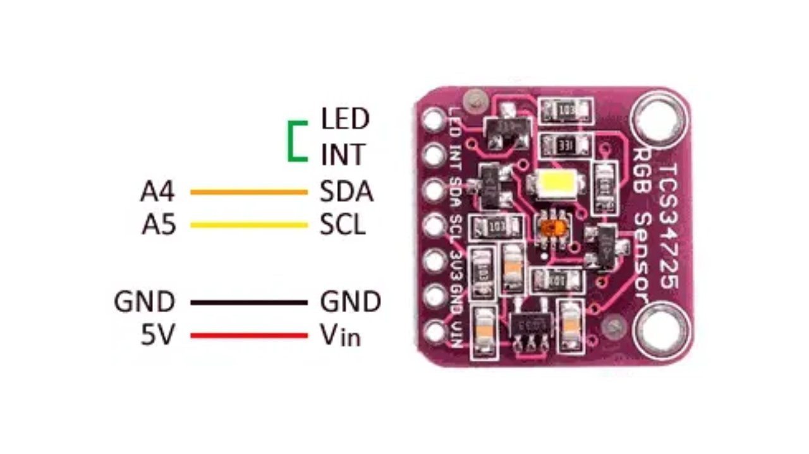
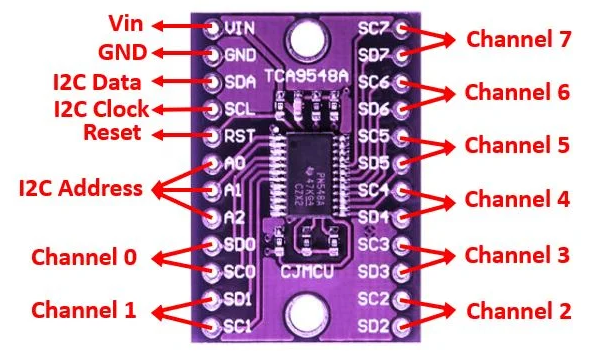
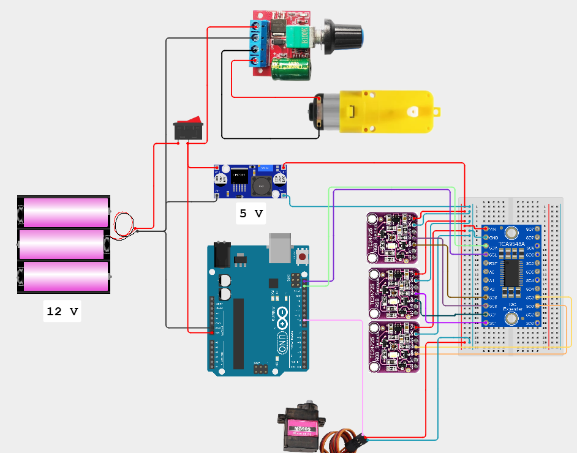

# Automatic Color-Based Sorting System with Conveyor

## Project Domain

This project focuses on a real-time IoT-based object color classification and sorting system using TCS34725 color sensors, controlled via a TCA9548A I2C multiplexer and an Arduino microcontroller, integrated with a servo for mechanical actuation.

### Problem Statements

* Manual sorting based on color is inefficient, time-consuming, and prone to human error.
* Need for a low-cost and scalable solution for object classification in educational or small-scale industrial settings.
* Difficulty in handling multiple I2C color sensors simultaneously due to address conflicts.
* Single-sensor classification may be inaccurate due to lighting variation, noise, or sensor failure.

### Goals

* Detect and classify objects based on their color using multiple TCS34725 sensors.
* Use majority voting from multiple sensors to increase classification accuracy and fault tolerance.
* Activate a servo motor to perform an action (e.g., sorting, signaling) when a specific color is detected.

### Solution Statements

* Use TCS34725 sensors to obtain RGB and clear values from detected objects.
* Implement a TCA9548A I2C multiplexer to control multiple identical I2C sensors.
* Apply color classification logic and **majority voting (fault tolerant system)** to determine the dominant object color from all sensor inputs.
* Control a servo motor to respond to detected color (e.g., move when red is detected).
* Display sensor data and classifications through Serial Monitor for evaluation and debugging.

## Fault Tolerance Mechanism

To ensure the system is robust against false readings from any single sensor, this project includes:

* **Redundancy**: Three sensors observe the same object simultaneously.
* **Majority Vote Logic**: The system compares classifications from all sensors. If at least **two sensors agree on the same color**, that classification is considered correct.
* **Fallback Handling**: If fewer than two sensors detect an object or no majority is found, the system safely assumes "No object" or "Unknown", and the actuator remains idle.
* **Improved Accuracy**: This mechanism increases classification reliability under inconsistent lighting or partial occlusion.

## Prerequisites

### Component Preparation

* **Arduino Uno / Nano**: Microcontroller for processing sensor data and controlling servo.
* **3× Adafruit TCS34725 Color Sensors**: Detects RGB values of objects.
* **TCA9548A I2C Multiplexer**: Allows multiple I2C devices with same address to operate independently.
* **Servo Motor (SG90 or equivalent)**: Performs mechanical actuation based on color classification.
* **Jumper Wires & Breadboard**: For prototyping and connections.
* **Power Supply (5V)**: To power the microcontroller and sensors.

### Datasheet TCS34725

### Datasheet TCA9548A

### Schematic Fritzing

## Demo and Evaluation

* **Setup**: Connect 3 TCS34725 sensors to the TCA9548A, wire the multiplexer to the Arduino via I2C, and attach the servo motor to a digital pin.
* **Demo**: Place Tomato (ripe, raw) in front of the sensors. Observe the readings and servo response based on classification results.
* **Evaluation**: Verify sensor consistency, classification accuracy, and servo response timing. Modify classification thresholds as needed based on environment and object reflectivity.

[Demo Video / Project Preview](assets\Demo.mp4)

## Conclusion

This project demonstrates a simple, efficient, and scalable system for color-based object classification and response using multiple TCS34725 sensors and an Arduino. The integration of a TCA9548A multiplexer solves I2C address conflicts, and the **majority-vote fault-tolerant logic** enhances system reliability. This system can be expanded to automate sorting tasks in educational demonstrations or embedded applications.

---

## Members & Identification

* **Dos Hansel Sihombing** – 235150301111001
* **Reditya Imanuel Yuwono** – 235150301111007  
* **Muchammad Ryan Afif** – 235150301111008  
* **Daffa Fawwaz Garibaldi** – 235150307111011  
* **Khalisa Nur Safira** – 235150307111012